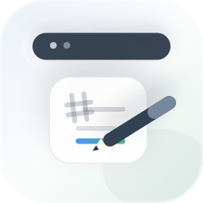
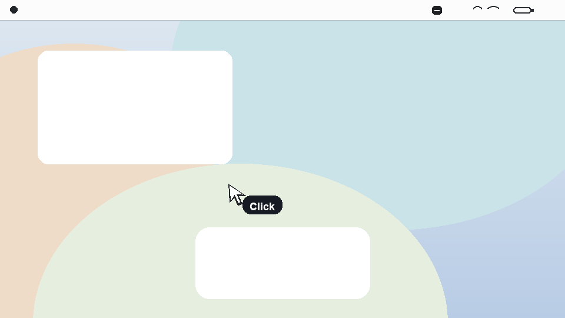
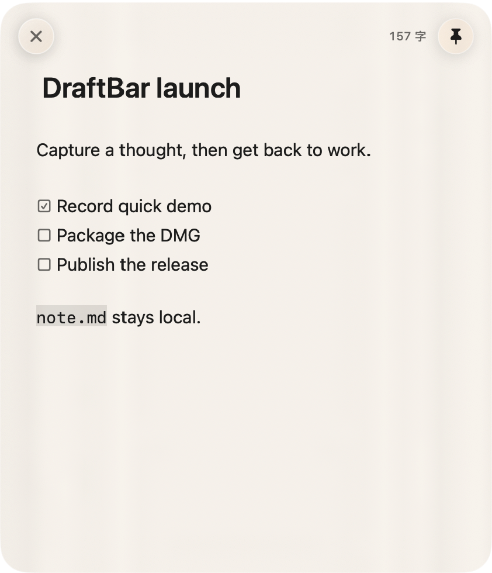

  <a href="README.md">English</a>

# DraftBar

macOS 菜单栏里的随手草稿纸。 ✏️

  

  
  
  

  <strong><a href="https://github.com/917Dhj/DraftBar/releases/latest">📥 下载 macOS 版</a></strong>

DraftBar 常驻菜单栏，在你需要临时记一段话、列一个待办、草拟一点 Markdown 时快速弹出，不打断当前工作流。

## 🎬 演示

从菜单栏唤起 DraftBar，快速记下一段草稿，然后回到原来的工作。你也可以从菜单栏图标拖出草稿窗，把它放在更顺手的位置。

| 快速捕获 | 编辑器细节 |
| --- | --- |
|  |  |

## ✨ 功能

| 功能 | 说明 |
| --- | --- |
| 🧭 菜单栏草稿纸 | 常驻菜单栏，一次点击就能开始记录，不需要打开完整笔记应用。 |
| 🪟 浮动草稿窗 | 可以从菜单栏拖出、移动、调整大小，也可以固定在其他窗口上方。 |
| 📝 Markdown 友好编辑 | 支持标题、列表、任务复选框、链接、代码块和公式的轻量内联样式。 |
| 💾 本地 Markdown 文件 | 草稿以普通 `note.md` 文件保存在你的 Mac 上。 |
| 🖥️ 原生 macOS 体验 | 小型 accessory app，半透明浮动面板，并有状态栏图标状态。 |

## 📥 安装

1. 从 [GitHub Releases](https://github.com/917Dhj/DraftBar/releases/latest) 下载最新 `.dmg`。
2. 打开 DMG，把 DraftBar 拖入 Applications。
3. 启动 DraftBar，它会出现在 macOS 菜单栏。

## ⌨️ 使用

- 点击菜单栏图标打开草稿。
- 从菜单栏图标拖出浮动草稿窗，并放到顺手的位置。
- 使用 pin 按钮让草稿窗保持在其他窗口上方。
- 右键点击菜单栏图标，可以打开本地草稿文件或退出 DraftBar。

## 🔒 数据与隐私

DraftBar 会把草稿作为 Markdown 文件保存在本地：

`~/Library/Application Support/DraftBar/note.md`

不需要账号，没有云同步，也没有追踪。

## 🗺️ 路线图

- 按需要完善签名、公证等 release 打包细节
- 继续打磨 Markdown 编辑体验

## 🤝 参与贡献

欢迎通过 issue 反馈想法和问题。如果 DraftBar 还没有贴合你的工作流，或者你遇到了值得改进的细节，可以直接开 issue。

## 📜 许可证

MIT
